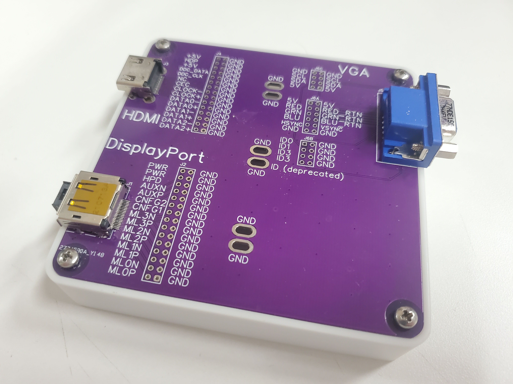

# Video cable breakout

A small breakout board for various video connectors (DisplayPort, HDMI and VGA so far).

Other than ground, there is no connection between the 3 different video connectors.

The board breaks out the video signals to several 0.1" headers. These 0.1" headers can be loaded with male pins, female pins or nothing at all depending on what you want to use the board for. The 3 pairs of larger holes in the middle of the board are intended for connecting the alligator clip for the ground connection of an osciloscope probe.

Photo of assembled board sitting on a my [Generic Board Box](https://github.com/PhilboBaggins/generic-board-box). This video cable breakout board does not have any of the 0.1" headers soldered because I was just using the board for an easy place to probe signals with an oscilloscope.

## Licence

Copyright © 2023 Phil Baldwin

This work is licensed under a Creative Commons Attribution-ShareAlike 4.0 International License.

You should have received a copy of the license along with this work. If not, see <http://creativecommons.org/licenses/by-sa/4.0/>.
